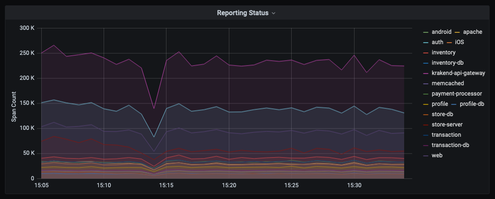
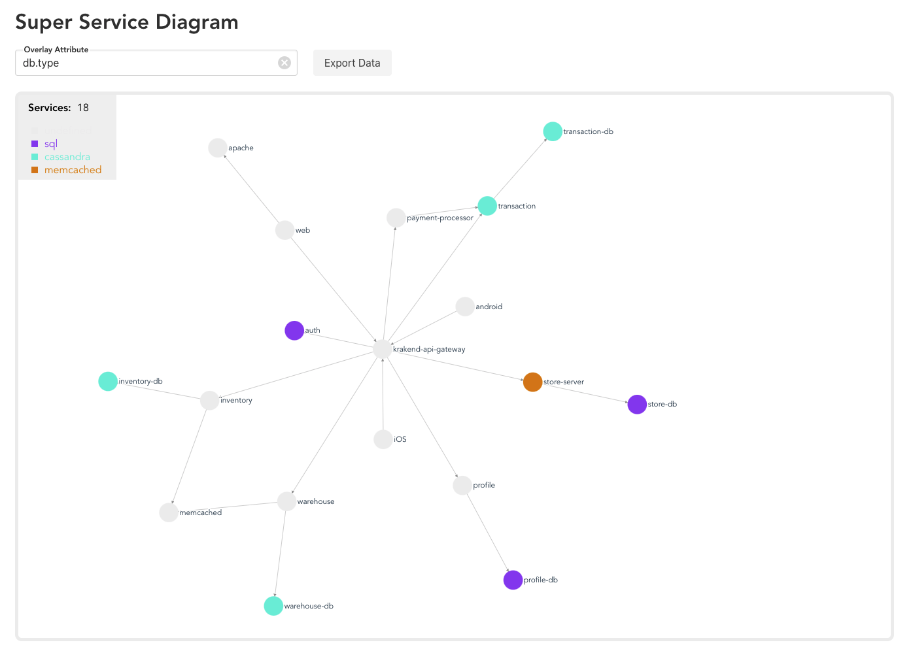

# Lightstep API Cookbook

This is a collection of various examples of using the Lightstep API and integrating Lightstep Data within your workflows. Note: This collection will expand over time.

## Table of Contents

- [Lightstep API Cookbook](#lightstep-api-cookbook)
  - [Table of Contents](#table-of-contents)
    - [Reporting Status Timeseries](#reporting-status-timeseries)
    - [Trace Differ](#trace-differ)
    - [Super Service Diagram](#super-service-diagram)
    - [Auto Streams](#auto-streams)
    - [Node.js Command Line Interface (CLI)](#nodejs-command-line-interface-cli)

### Reporting Status Timeseries

Take the Reporting Status page of Lightstep and convert it into a Timeseries to have granular visibility into spans sent, dropped spans, etc. per service.

[Example with Node-RED (or NodeJS), InfluxDB, and Grafana](./reporting-status-timeseries)

### Trace Differ

Take recurring snapshots for a query, and caluclate differences for a set of group-by keys.

[Example with MEVN stack](./trace-differ)

### Super Service Diagram

This example project uses Lightstep APIs to build a "static" service diagram of your system architecture and provides the additional capability to filter by attributes and their values to overlay on the service diagram.

[Example with MEVN stack](./super-service-diagram)

### Auto Streams

[Utility](./auto-streams) for using Lightstep APIs to automatically create streams for all your services if they don't exist.

### Node.js Command Line Interface (CLI)

Some of the API functionality (taking snapshots, listing projects and services) is available using a convenience CLI provided by the [`lightstep-js-sdk`](https://github.com/lightstep/lightstep-api-js) project. See the project README for examples.
