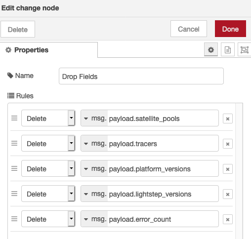
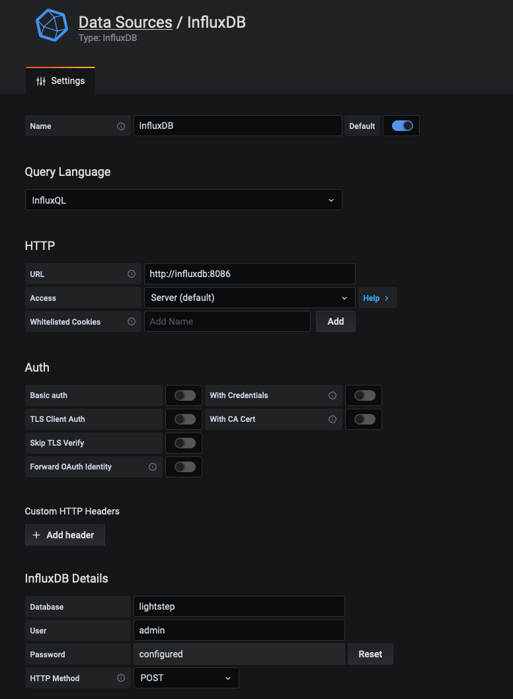

Lightstep recently added several [new APIs](https://api-docs.lightstep.com/reference)  to help developers access the high value data being sent to Lightstep from their systems and integrate the rich analysis built on that data into their existing workflows

As a quick overview, Lightstep customers send [TODO: billions of spans] data from their applications to [Lightstep Satellites](https://lightstep.com/how-it-works) hosted and managed in their own environments. Data going to the Satellites is not sampled at the clients. Hence, depending on available resources (satellite instances) and throughput of data, sometimes some spans get dropped, either at the client (throughput too high) or at the Satellites (not enough satellites). While there are controls available for [monitoring](/docs/monitor-satellite-pools-and-satellites) and for [resolving](/docs/load-balance-lightstep) issues with dropped spans, when it happens, the first question that is usually asked is "Which service was the problematic one?".

Lightstep offers a [Reporting Status](/docs/monitor-services-tracers-and-satellites#clients-report-table) view for all applications currently reporting data to the Lightstep Satellites. This view pulls metrics from the Satellites directly, and only displays the "last" metric at a point in time. While this is useful for just-in-time debugging, it does not have enough data for analyzing historical discrepancies and span volume. This is where the newly released Reporting Status API(TODO: LINK) can help.

## Reporting Status Timeseries

In this tutorial, we will setup the following simple workflow:

**1. Call the Lightstep Reporting Status API** - Since this is just a simple REST call, the possibilities on how you want to do this are endless. I chose [Node-RED](https://github.com/node-red/node-red) because it has a simple, flexible, low-code graphical interface for creating a workflow that can be scheduled. Node-RED is built for event driven applications, but it will also work for this scheduled cron job case.

**2. Storing the returned results in a timeseries database** - Any timeseries database should work as long as you have a way to write data to it in Step 1 and read data from it in Step 3. I chose [InfluxDB](https://github.com/influxdata/influxdb)

**3. Visualize the data** - In my opinion, [Grafana](https://github.com/grafana/grafana) is quite possibly the best open source graph visualization solution out there

## Prerequisites

- You will need a Lightstep API key. [Get it here](/docs/create-and-manage-api-keys).
- Docker and `docker-compose` installed on your machine

## Setup

The following `docker-compose.yml` sets up a container each for Node-RED, InfluxDB, and Grafana, maps the appropriate default ports, and connects them all as part of one docker network for easier communication.

```yaml
version: "3"
services:
  nodered:
    image: nodered/node-red:latest-12
    container_name: nodered
    ports:
      - 1880:1880
    networks:
      - lightstep
  influxdb:
    image: influxdb:1.8-alpine
    container_name: influxdb
    ports:
      - 8086:8086
    environment:
      - INFLUXDB_DB=lightstep
      - INFLUXDB_USER=lightstep
      - INFLUXDB_ADMIN_ENABLED=true
      - INFLUXDB_ADMIN_USER=admin
      - INFLUXDB_ADMIN_PASSWORD=admin
    networks:
      - lightstep
  grafana:
    image: grafana/grafana:7.3.0
    container_name: grafana
    ports:
      - 3000:3000
    networks:
      - lightstep
networks:
  lightstep:
```

```shell
$ docker-compose up -d
```

## Node-RED Workflow

This is the workflow we will be building in Node Red


Before we start developing our workflow, we need to install two nodes that are not included out of the box. [node-red-contrib-cron-plus](https://flows.nodered.org/node/node-red-contrib-cron-plus/) for scheduling our flow, and [node-red-contrib-influxdb](https://flows.nodered.org/node/node-red-contrib-influxdb) for writing data to InfluxDB.

```shell
# SSH into the container
$ docker exec -it nodered bash

# Install the packages
bash-5.0$ npm install --save node-red-contrib-cron-plus node-red-contrib-influxdb

# Exit the container
bash-5.0$ exit

# Restart the node container for the new nodes to register
$ docker-compose restart nodered
```

Now, visit `localhost:1880` in your browser to access the Node-RED GUI. You should have the newly installed cronplus and influxdb nodes in the left drawer. Let's start building our workflow.

**1. Schedule Trigger** - Drag the `cron-plus` node on to the board and double click to configure it. We want our flow to trigger every minute, which maps to a cron schedule of `0 * * * * * *`. This should already be selected as default. Feel free to change any metadata you want or other options for the node.

**2. Get Reporting Status** - When triggered, we want our flow to make an HTTP call to [Lightstep API](https://api-docs.lightstep.com/reference). We will use the `http request` node for this. Drag it on to the board and double click to configure the settings. Set Method to "GET" and URL to "https://api.lightstep.com/public/v0.2/ORGANIZATION/projects/PROJECT/reporting-status", substituing your organization and project names. Check the "Use Authentication" box, set the type to "bearer authentication" and paste in your API key into the subsequent box. Finally, click the "Return" dropdown and choose "a parsed JSON object". Give it a name if you'd like to. This is what our node should look like.


**3. Cleanup Data** - The response from the Lightstep API includes a JSON object, and the result is a nested array of values for each service. We will add a `function` node to just get the array

```javascript
msg.payload = msg.payload.data.status;
return msg;
```

a `split` node to split the array into individual messages


and a `change` node to drop some fields that are not needed.



**4. Map tags** - Before we send the data to InfluxDB, we map some fields that we would like to group by in Grafana later. The [influxdb-out](https://flows.nodered.org/node/node-red-contrib-influxdb#output-node) interprets two objects inside an array of a message that is sent to the node as values and tags. So we use a `function` node to convert our simple message object back into an array so that it is written to the DB appropriately.

```javascript
var tmp = msg.payload;
msg.payload = [
  {
    spans_count: tmp.spans_count,
    dropped_spans_count: tmp.dropped_spans_count,
    collector_dropped_spans_count: tmp.collector_dropped_spans_count,
    updated_micros: tmp.updated_micros,
  },
  {
    component_name: tmp.component_name,
    platform: tmp.platform,
  },
];
return msg;
```

**5. Write to InfluxDB** - Finally, drag an influxdb node to the board and double click the node to setup a database first, with the values pointing to our InfluxDB container. Then, set a name for the "Measurement" field to be able to distinguish data in InfluxDB if you choose to use it for other purposes later. I set this as "rs" for reporting status.


{: .callout}

We can use the name `influxdb` as host, because all our containers are part of the same network. So the container name resolves to the IP address. Otherwise you can also `docker inspect influxdb` to get the IP address of the container and set that as host.

#### Connect the Flow

Finally, lets draw the connections between the nodes and Deploy the flow from the top right. If everything is set up correctly, the flow should start pushing data to InfluxDB every minute. You can click the bug icon in the right sidebar to debug the flow, any errors would show up there.

This entire flow is set up in the UI, but you can also load it by importing the [`flow.json`](./example/flows.json) file into Node-RED.

## Grafana Visualization

Once the data is in InfluxDB we can visualize it in Grafana. Visit `localhost:3000` in your browser. If this is your first login, Grafana will ask for a username and password. `admin` is the default for both.

**1. Set up InfluxDB datasource**

[InfluxDB](https://grafana.com/docs/grafana/latest/datasources/influxdb/) is included as a bundled datasource in Grafana. You can configure it to point to our own database.



**2. Create a Reporting Status Timeseries panel**

Graphing our timeseries data in Grafana is pretty straightfoward. Create a new Panel and choose our InfluxDB datasource to select `span_count` (or `dropped_span_count` or `collector_dropped_span_count`) and group by `tag(component_name)` to graph the timeseries. Since we are gathering this data every minute, I also set the resolution of the panel to 1m.


You can now integrate this panel into other existing dashboards for your environments or services, including the Lightstep Satellite dashboards as well to better identify which services are reporting large volume of spans and dropping spans at either the client or Satellite level.
